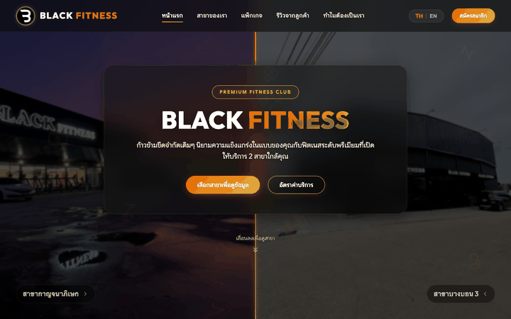

# Black Fitness - Premium Gym Landing Page

Welcome to the official repository for **Black Fitness**, a state-of-the-art, premium landing page designed for a modern fitness club with two major branches (Kanchanaphisek and Bangbon 3). 

This project is built to deliver a highly interactive, visually stunning, and responsive user experience that showcases the gym's premium atmosphere, facilities, membership rates, and real member testimonials.


## 📽️ Interactive Usage Demo

Below is an animated demonstration showcasing all key interactive features and transitions in real-time:



---

## ✨ Key Features

1. **Interactive Split-Screen Hero Background**
   - Hovering over a branch panel on desktop smoothly expands that panel (62% width) and shifts the glowing vertical divider in perfect synchronization.
   - Highlights the atmospheric imagery of each branch in a premium way.
   - Fully optimized for responsive layouts.

2. **Bilingual Support (TH / EN)**
   - Integrates a custom client-side translation engine.
   - Switch language seamlessly between Thai (TH) and English (EN) with a single toggle button in the navbar.
   - All text, headers, badges, packages, feature cards, and reviews instantly update without requiring a page reload.

3. **Floating Gym Equipment Particles**
   - Dynamic, subtle, and slow-moving background SVG particles (dumbbells, kettlebells, weight plates, muscle arms, cardio lines).
   - Styled with gold and orange gradient shades with variable sways, rotation angles, and speeds.
   - Creates a premium, atmospheric depth behind the layout.

4. **Multi-Image Branch Carousel**
   - Each branch card features an automated/manual image slider showcasing multiple high-resolution, contrast-enhanced photos of the gym facilities.
   - Clean next/prev navigation arrows and slide dot indicators.
   - Automatically pauses on hover for uninterrupted browsing.

5. **Flexible Pricing Cards**
   - Clear display of current membership packages (1 Month, 3 Months, 6 Months, 1 Year).
   - Dynamic badges displaying "Popular" or "Best Value" and savings calculations.
   - Clean checkout/joining call-to-actions.

6. **Tabbed Member Reviews**
   - Tabbed review panel allowing users to toggle between reviews for the **Kanchanaphisek Branch** and the **Bangbon 3 Branch**.
   - Pulls real member feedback and ratings in a clean, readable card format.

7. **Fully Responsive Mobile Layout**
   - Mobile navigation header with animated drawer menu.
   - Stacked layout transitions with centered typography, optimized paddings, and custom mobile heights for comfortable readability.

---

## 🛠️ Technology Stack

- **HTML5**: Structured semantic markup.
- **Vanilla CSS3**: Tailored layout, animations, CSS custom properties, and glassmorphic designs.
- **Vanilla JavaScript**: Dynamic split screen hover states, translation engine, sliders, scroll highlights, and mobile menu toggles.
- **Vite**: Ultra-fast frontend development server and bundling tool.
- **Lucide Icons**: Modern, clean SVG icon set.

---

## 🚀 Running Locally

Follow these steps to run the project on your local machine:

### Prerequisites
Make sure you have [Node.js](https://nodejs.org/) installed (version 14 or higher is recommended).

### 1. Clone the Repository
```bash
git clone https://github.com/EdmaeMongkon/Black-Fitness.git
cd Black-Fitness
```

### 2. Install Dependencies
```bash
npm install
```

### 3. Start the Development Server
```bash
npm run dev
```

Open your browser and navigate to `http://localhost:5173` to see it running!

### 4. Build for Production
To build the project for production (compiling minimized assets in the `dist/` folder):
```bash
npm run build
```
